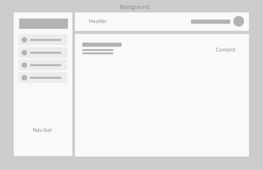
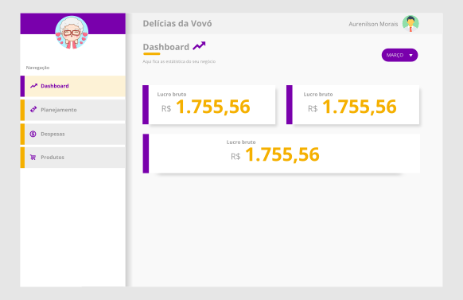

# Desafio Mercearia

Nesse desafio vamos trabalhar com um pouco de lógica no front-end visando desenvolver o Javascript com um sistema básico de gestão de produtos e o conhecimento em Design. 

```
1 - Desenvolver habilidades na interpretação de textos;
2 - Desenvolver o layout do sistema;
3 - Desenvolver o design pattern e UI/UX;
4 - Desenvolver o sistema usando lógica em javascript;
5 - Desenvolver o raciocínio lógico;
```

## O Briefing (Atenção)

Dona Mafalda tem uma mercearia a anos e sua neta questionou ela sobre os seus ganhos; Sem saber sobre a resposta, a vovó falou: 
Eu sempre pago minhas contas e o meu salário às vezes vem variável. Em caixa havia R$ 2.389,32 e no mês de Março eu tive um gasto de R$ 4.356,00 em mantimentos para fazer os meus bolos, recebi R$ 2.876,57 em dinheiro e R$ 14.756,32 em cartão. Meu salário é de R$ 3.566,00, minha energia é R$ 2.879,00(Forno elétrico), meu aluguel é R$ 4.561,00, gasto R$ 150,00 com água e R$ 99,00 com internet, R$ 659,54 com gasolina para entregar os bolos e 2.500,00 com o meu funcionário. Eu também pago R$ 600,00 de contabilidade e R$900,00 em impostos, INSS e Simples Nacional.

1. Qual é o lucro bruto do mês de março?
2. Sabendo que o bolo é R$ 20,00, quantos bolos foram vendidos para chegar no lucro líquido?
3. Quais são as despesas variáveis e as despesas fixas.
4. Quanto sobrou de caixa?
5. Quanto foi o lucro líquido?
6. Quanto foi o lucro bruto?
7. No mês de abril ela quer lucrar R$ 5.000,00 a mais, quantos bolos ela vai ter que vender?
8. Ela quer vender Cupcake a R$ 4,50 e pretende fazer apenas 100 unidades por semana.
9. Em seu planejamento estratégico  em 12 meses ela precisa dobrar suas vendas, mas pra isso precisa comprar equipamentos com o custo de R$ 30.000,00 e alugar um espaço maior R$ R$8.000,00/mês. Sua operação vai de 1 para 4 funcionários
    1. Quanto ela precisa juntar para ter o que precisa no período de 12 meses?
    2. Sua operação (despesas fixas) vai ficar quanto ao mês?

- Com base nessas questões acima crie um dashboard com uma projeção de gastos no mês com um filtro para gastar trocar os meses;
- Uma página para cadastros de despesas;
- Uma página para cadastro de produto, (no caso somente para cadastrar o bolo e o seu valor);
- Uma página para projetar o planejamento estratégico.
- Inserir as informações do mês de Março no banco e consultar no dashboard.

## Regras de desenvolvimento

Usar [IndexedDB](https://web.dev/indexeddb/) para gravar no banco de dados a lógica de estado no front.

Usar [Classes](https://www.w3schools.com/js/js_classes.asp) para construir a lógica da construção dos objetos.

Usar [Bootstrap](https://www.w3schools.com/bootstrap5/index.php) para construir o layout.

### Desejável
Ganha pontos para quem empregar a ortografia brasileira sem errar;

Ganha pontos para quem usar o [ChartJS](https://www.chartjs.org/)

Ganha pontos para quem usar o [VueJs](https://vuejs.org/guide/quick-start.html#creating-a-vue-application)

Ganha pontos para quem usar o [Vuetify](https://vuetifyjs.com/en/getting-started/installation/)

## Branding da marca:

Com base nas informações acima é pra criar um layout com a identidade visual da Marca, que Marca? Fica na tua Imaginação.

<aside>
🗣 Nome: Delícias da Vovó
</aside>

<aside>
📌 Cores: #7900ac; #f5b000; #000000;
</aside>

<aside>
🤐 Font-principal: Bebas Neue;
</aside>

<aside>
😘 Font-apoio: Oxygen;
</aside>

## Wireframe

É o desenho da estrutura, o posicionamento das chamadas de destaque e menus, ou seja, um “esqueleto” do que planejamos fazer - e que irá nortear o desenvolvimento, facilitando a previsão de soluções amigáveis/usabilidade para o usuário que vai navegar no projeto.



*Já com wireframe acima desenvolva o layout com cores, fontes e logo da marca de um jeito mais profissional.*

Note que temos o Header, foi posicionado o avatar e o nome da pessoa. Ao lado temos a barra de navegação, onde vamos posicionar o logo e os botões de menu, que ao clicar deve mudar o conteúdo no content.

# Exemplo: Não é pra fazer igual


